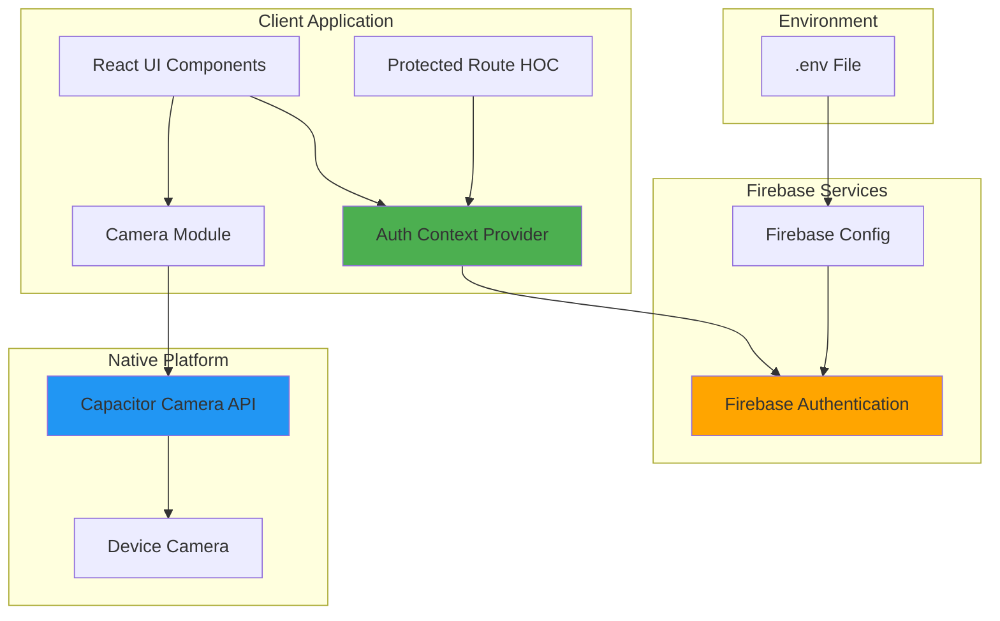
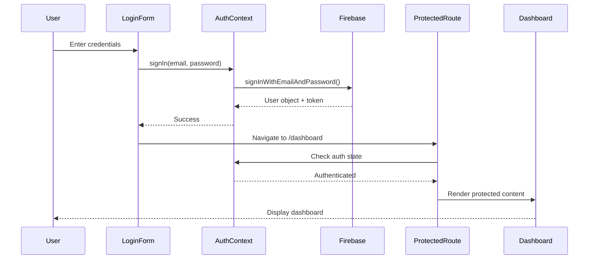
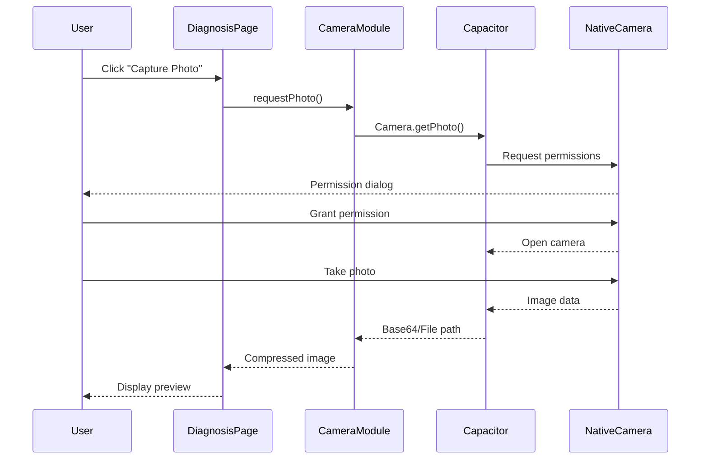

# Design Document: Production-Ready Mobile Authentication

## Overview

This design document specifies the architecture for implementing a production-ready mobile authentication system for AgriResolve AI. The system integrates Firebase Authentication with a mobile-optimized user interface, native camera access via Capacitor, secure credential management, and comprehensive code quality improvements.

### Goals

- Implement secure user authentication using Firebase Authentication SDK
- Provide mobile-optimized UI/UX with touch-friendly components
- Enable native camera access for crop image capture on mobile devices
- Secure Firebase credentials using environment variables
- Improve code quality through deduplication and refactoring
- Create an investor-ready prototype with professional polish

### Non-Goals

- Social authentication providers (Google, Facebook, etc.) - future enhancement
- Multi-factor authentication (MFA) - future enhancement
- User profile editing beyond email display - future enhancement
- Offline authentication - requires online Firebase connection
- Custom authentication backend - using Firebase as the auth provider

### Key Design Decisions

1. **Firebase Authentication**: Chosen for its robust security, session management, and ease of integration with React applications
2. **Capacitor Camera Plugin**: Provides native camera access with automatic web fallback, avoiding custom platform-specific code
3. **Context-based Auth State**: React Context API for global authentication state management, avoiding prop drilling
4. **Protected Route HOC**: Higher-order component pattern for route protection, ensuring consistent auth checks
5. **Environment Variable Prefixing**: Vite's `VITE_` prefix convention for client-accessible Firebase config
6. **Component-based Architecture**: Modular, reusable components for auth UI to maintain consistency

## Architecture

### System Architecture



### Authentication Flow



### Camera Capture Flow



## Components and Interfaces

### Firebase Configuration Module

**Location**: `src/config/firebase.ts`

**Purpose**: Initialize and export Firebase app instance with configuration from environment variables.

**Interface**:
```typescript
// Firebase configuration object
interface FirebaseConfig {
  apiKey: string;
  authDomain: string;
  projectId: string;
  storageBucket: string;
  messagingSenderId: string;
  appId: string;
}

// Exported Firebase instances
export const app: FirebaseApp;
export const auth: Auth;
```

**Implementation Notes**:
- Load configuration from `VITE_FIREBASE_*` environment variables
- Validate all required config values are present
- Throw descriptive error if configuration is missing
- Initialize Firebase app singleton
- Export auth instance for use across the application

### Authentication Context

**Location**: `src/contexts/AuthContext.tsx`

**Purpose**: Provide global authentication state and methods to all components.

**Interface**:
```typescript
interface AuthContextType {
  currentUser: User | null;
  loading: boolean;
  signUp: (email: string, password: string) => Promise<UserCredential>;
  signIn: (email: string, password: string) => Promise<UserCredential>;
  signOut: () => Promise<void>;
  resetPassword: (email: string) => Promise<void>;
}

export const AuthProvider: React.FC<{ children: ReactNode }>;
export const useAuth: () => AuthContextType;
```

**Implementation Notes**:
- Use Firebase `onAuthStateChanged` observer for real-time auth state
- Set `loading` to true during initial auth state check
- Persist session using Firebase's built-in token management
- Handle auth errors and throw with descriptive messages
- Cleanup observer on unmount

### Protected Route Component

**Location**: `src/components/ProtectedRoute.tsx`

**Purpose**: Wrap routes that require authentication, redirecting unauthenticated users to login.

**Interface**:
```typescript
interface ProtectedRouteProps {
  children: ReactNode;
  redirectTo?: string;
}

export const ProtectedRoute: React.FC<ProtectedRouteProps>;
```

**Implementation Notes**:
- Check `currentUser` from AuthContext
- Show loading spinner while auth state is being determined
- Redirect to `/login` (or custom path) if not authenticated
- Preserve intended destination in location state for post-login redirect
- Render children if authenticated

### Authentication UI Components

**Location**: `src/components/auth/`

#### LoginForm Component

**Purpose**: User login interface with email/password inputs.

**Interface**:
```typescript
interface LoginFormProps {
  onSuccess?: () => void;
}

export const LoginForm: React.FC<LoginFormProps>;
```

**Features**:
- Email and password input fields with validation
- Password visibility toggle
- Loading state during authentication
- Error message display
- "Forgot Password" link
- Link to signup form
- Touch-friendly button sizes (min 44x44px)

#### SignupForm Component

**Purpose**: New user registration interface.

**Interface**:
```typescript
interface SignupFormProps {
  onSuccess?: () => void;
}

export const SignupForm: React.FC<SignupFormProps>;
```

**Features**:
- Email, password, and password confirmation fields
- Real-time password strength indicator
- Inline validation errors
- Loading state during registration
- Link to login form
- Touch-friendly design

#### AuthLayout Component

**Purpose**: Consistent layout wrapper for auth pages.

**Interface**:
```typescript
interface AuthLayoutProps {
  children: ReactNode;
  title: string;
}

export const AuthLayout: React.FC<AuthLayoutProps>;
```

**Features**:
- Centered card layout
- AgriResolve AI branding
- Responsive design (mobile-first)
- Professional styling with shadows and borders

### Camera Module

**Location**: `src/services/camera.ts`

**Purpose**: Abstract camera access using Capacitor with web fallback.

**Interface**:
```typescript
interface CameraOptions {
  quality?: number; // 0-100
  allowEditing?: boolean;
  resultType?: 'base64' | 'uri' | 'dataUrl';
  source?: 'camera' | 'photos';
}

interface CameraPhoto {
  base64String?: string;
  dataUrl?: string;
  path?: string;
  format: string;
}

export async function capturePhoto(options?: CameraOptions): Promise<CameraPhoto>;
export async function requestCameraPermissions(): Promise<boolean>;
export function isCameraAvailable(): boolean;
```

**Implementation Notes**:
- Use `@capacitor/camera` plugin for native access
- Detect platform (iOS, Android, Web) and adjust behavior
- Compress images to 80% quality by default for mobile optimization
- Fall back to HTML5 file input on web browsers
- Handle permission denials gracefully with user-friendly messages
- Support both camera capture and photo library selection

### Camera Button Component

**Location**: `src/components/CameraButton.tsx`

**Purpose**: Reusable button component for triggering camera capture.

**Interface**:
```typescript
interface CameraButtonProps {
  onPhotoCapture: (photo: CameraPhoto) => void;
  onError?: (error: Error) => void;
  disabled?: boolean;
  className?: string;
}

export const CameraButton: React.FC<CameraButtonProps>;
```

**Features**:
- Camera icon with label
- Loading state during capture
- Error handling and display
- Touch-friendly size
- Disabled state styling

### User Profile Component

**Location**: `src/components/UserProfile.tsx`

**Purpose**: Display user information and logout option in header.

**Interface**:
```typescript
interface UserProfileProps {
  className?: string;
}

export const UserProfile: React.FC<UserProfileProps>;
```

**Features**:
- User avatar (initials from email)
- Email display
- Dropdown menu with logout option
- Mobile-responsive design
- Smooth animations

## Data Models

### User Model

Firebase Authentication provides the user object with the following relevant fields:

```typescript
interface User {
  uid: string;              // Unique user identifier
  email: string | null;     // User email address
  emailVerified: boolean;   // Email verification status
  displayName: string | null;
  photoURL: string | null;
  metadata: {
    creationTime: string;
    lastSignInTime: string;
  };
}
```

**Usage**: Accessed via `currentUser` in AuthContext.

### Camera Photo Model

```typescript
interface CameraPhoto {
  base64String?: string;    // Base64-encoded image data
  dataUrl?: string;         // Data URL format (data:image/jpeg;base64,...)
  path?: string;            // File system path (native only)
  format: string;           // Image format (jpeg, png, etc.)
  exif?: any;              // EXIF metadata (optional)
}
```

**Usage**: Returned from camera capture, passed to image upload/analysis functions.

### Firebase Configuration Model

```typescript
interface FirebaseConfig {
  apiKey: string;           // Firebase API key
  authDomain: string;       // Firebase auth domain
  projectId: string;        // Firebase project ID
  storageBucket: string;    // Firebase storage bucket
  messagingSenderId: string; // Firebase messaging sender ID
  appId: string;            // Firebase app ID
}
```

**Storage**: Environment variables with `VITE_FIREBASE_` prefix.

## Correctness Properties


*A property is a characteristic or behavior that should hold true across all valid executions of a system—essentially, a formal statement about what the system should do. Properties serve as the bridge between human-readable specifications and machine-verifiable correctness guarantees.*

### Property 1: User Registration Creates Account

*For any* valid email and password combination, when a new user signs up, the system should successfully create a user account in Firebase and return the user object with a unique identifier.

**Validates: Requirements 1.2**

### Property 2: Valid Credentials Authenticate User

*For any* existing user with valid credentials, when they attempt to sign in, the system should successfully authenticate them and establish an active session with a valid Firebase token.

**Validates: Requirements 1.3**

### Property 3: Session Persistence Across Refresh

*For any* authenticated user, when the page is refreshed, the system should maintain the authentication state by restoring the session from Firebase tokens without requiring re-authentication.

**Validates: Requirements 1.5**

### Property 4: Logout Clears Authentication State

*For any* authenticated user, when they log out, the system should terminate the session, clear all authentication state, and redirect to the login page.

**Validates: Requirements 1.6, 8.3**

### Property 5: Protected Routes Redirect Unauthenticated Users

*For any* protected route, when an unauthenticated user attempts to access it, the system should redirect them to the login page and preserve the intended destination URL for post-login redirection.

**Validates: Requirements 1.7, 7.2, 7.4**

### Property 6: Authenticated Users Access Protected Content

*For any* protected route, when an authenticated user accesses it, the system should render the requested component without redirection.

**Validates: Requirements 7.3**

### Property 7: Error States Display User-Friendly Messages

*For any* error condition (authentication failure, missing configuration, permission denial, camera error), the system should display a descriptive, user-friendly error message that helps the user understand and resolve the issue.

**Validates: Requirements 1.4, 2.5, 3.6, 9.5**

### Property 8: Form Validation Shows Inline Errors

*For any* invalid form input (empty fields, mismatched passwords, invalid email format), the system should display inline validation error messages without submitting the form.

**Validates: Requirements 5.3**

### Property 9: Success Operations Show Confirmation

*For any* successful authentication operation (signup, login), the system should display a success message to confirm the action completed successfully.

**Validates: Requirements 5.7**

### Property 10: Camera Capture Returns Compressed Image

*For any* photo captured through the camera module, the system should return the image data to the application in a compressed format (default 80% quality) to optimize upload performance on mobile networks.

**Validates: Requirements 3.4, 3.8**

### Property 11: Responsive UI Without Overflow

*For any* viewport size (mobile, tablet, desktop), all UI components should render responsively without horizontal scrolling, with touch-friendly button sizes (minimum 44x44 pixels), and proper spacing for the screen size.

**Validates: Requirements 4.1, 4.2, 4.6**

### Property 12: Loading States During Async Operations

*For any* asynchronous operation (authentication, data fetching, image upload), the system should display appropriate loading indicators (spinners, skeleton screens, or progress bars) while the operation is in progress.

**Validates: Requirements 5.4, 10.3**

### Property 13: Authentication State Reflected in UI

*For any* authentication state change (login, logout, session restore), the UI should immediately reflect the current state by showing/hiding user profile information, updating navigation options, and displaying appropriate content.

**Validates: Requirements 8.4**

### Property 14: Runtime Errors Caught by Error Boundaries

*For any* runtime error thrown within a React component, the error boundary should catch the error and display a fallback UI instead of crashing the entire application.

**Validates: Requirements 10.4**

### Property 15: Interactive Elements Provide Visual Feedback

*For any* interactive element (buttons, links, inputs), the system should provide visual feedback on user interaction through hover states, active states, focus indicators, and appropriate ARIA attributes for accessibility.

**Validates: Requirements 10.5, 10.7**

### Property 16: Empty States Show Helpful Guidance

*For any* empty data state (no history, no results, no content), the system should display a helpful empty state message with clear calls to action guiding the user on what to do next.

**Validates: Requirements 10.8**

### Property 17: Code Refactoring Preserves Functionality

*For any* existing feature, after code refactoring and deduplication, all previously passing tests should continue to pass, ensuring that functionality is preserved while code structure is improved.

**Validates: Requirements 6.7**

## Error Handling

### Authentication Errors

**Firebase Auth Error Codes**: The system will handle common Firebase authentication errors and map them to user-friendly messages:

- `auth/email-already-in-use`: "This email is already registered. Please log in instead."
- `auth/invalid-email`: "Please enter a valid email address."
- `auth/operation-not-allowed`: "Email/password authentication is not enabled. Please contact support."
- `auth/weak-password`: "Password should be at least 6 characters long."
- `auth/user-disabled`: "This account has been disabled. Please contact support."
- `auth/user-not-found`: "No account found with this email address."
- `auth/wrong-password`: "Incorrect password. Please try again."
- `auth/too-many-requests`: "Too many failed attempts. Please try again later."
- `auth/network-request-failed`: "Network error. Please check your connection and try again."

**Implementation**: Create an `authErrorHandler` utility function that maps Firebase error codes to user-friendly messages.

### Configuration Errors

**Missing Firebase Config**: If any required Firebase configuration value is missing from environment variables, the application should:

1. Throw a descriptive error during initialization
2. Display an error screen with instructions for developers
3. Prevent the app from attempting to use Firebase services
4. Log the specific missing configuration keys to the console

**Invalid Firebase Config**: If Firebase configuration values are present but invalid:

1. Firebase SDK will throw initialization errors
2. Catch these errors and display a configuration error message
3. Provide instructions to verify Firebase project settings

### Camera Errors

**Permission Denied**: When camera permissions are denied:

1. Display a modal or alert explaining why camera access is needed
2. Provide instructions on how to enable camera permissions in device settings
3. Offer alternative option to upload from photo library
4. On web, fall back to file input automatically

**Camera Not Available**: When camera hardware is not available:

1. Detect platform capabilities on component mount
2. Hide camera button if camera is not available
3. Show only file upload option
4. Display informative message about camera availability

**Capture Failures**: When photo capture fails:

1. Catch Capacitor Camera API errors
2. Display user-friendly error message
3. Allow user to retry capture
4. Log technical error details for debugging

### Network Errors

**Offline State**: When the device is offline:

1. Detect network status using existing `OfflineDetector` service
2. Display offline banner (already implemented)
3. Queue authentication requests for retry when online
4. Show appropriate error messages for failed operations

**Timeout Errors**: When Firebase requests timeout:

1. Set reasonable timeout values (10 seconds for auth operations)
2. Display timeout error message with retry option
3. Suggest checking network connection

### Form Validation Errors

**Client-Side Validation**: Before submitting to Firebase:

1. Validate email format using regex
2. Validate password length (minimum 6 characters)
3. Validate password confirmation matches
4. Display inline error messages below each field
5. Disable submit button until all validations pass

**Real-Time Validation**: As user types:

1. Debounce validation checks (300ms delay)
2. Show validation status with icons (checkmark, X)
3. Update error messages dynamically
4. Provide password strength indicator

### Error Boundary Implementation

**Component-Level Error Boundaries**: Wrap major sections:

1. Auth forms wrapped in `AuthErrorBoundary`
2. Protected routes wrapped in `RouteErrorBoundary`
3. Camera component wrapped in `CameraErrorBoundary`

**Error Boundary Fallback UI**:

```typescript
interface ErrorFallbackProps {
  error: Error;
  resetError: () => void;
}

// Display error message, stack trace (dev only), and reset button
```

**Error Logging**: In production, log errors to monitoring service (future enhancement).

## Testing Strategy

### Dual Testing Approach

This feature will employ both unit testing and property-based testing to ensure comprehensive coverage:

- **Unit Tests**: Verify specific examples, edge cases, error conditions, and integration points
- **Property Tests**: Verify universal properties across all inputs using randomized test data

Both testing approaches are complementary and necessary for comprehensive validation. Unit tests catch concrete bugs in specific scenarios, while property tests verify general correctness across a wide range of inputs.

### Property-Based Testing Configuration

**Library**: `fast-check` (already in dependencies)

**Configuration**:
- Minimum 100 iterations per property test (due to randomization)
- Each property test must reference its design document property
- Tag format: `// Feature: production-ready-mobile-auth, Property {number}: {property_text}`

**Example Property Test Structure**:

```typescript
import fc from 'fast-check';

describe('Authentication Properties', () => {
  it('Property 2: Valid Credentials Authenticate User', () => {
    // Feature: production-ready-mobile-auth, Property 2: Valid credentials authenticate user
    fc.assert(
      fc.asyncProperty(
        fc.emailAddress(),
        fc.string({ minLength: 6 }),
        async (email, password) => {
          // Create user
          await signUp(email, password);
          
          // Attempt login
          const result = await signIn(email, password);
          
          // Verify session established
          expect(result.user).toBeDefined();
          expect(result.user.email).toBe(email);
        }
      ),
      { numRuns: 100 }
    );
  });
});
```

### Unit Testing Strategy

**Authentication Context Tests**:
- Test initial loading state
- Test successful signup flow
- Test successful login flow
- Test logout flow
- Test session persistence on mount
- Test error handling for various Firebase errors
- Test auth state observer cleanup

**Protected Route Tests**:
- Test redirect when unauthenticated
- Test render when authenticated
- Test loading state during auth check
- Test destination URL preservation
- Test redirect after successful login

**Auth Form Component Tests**:
- Test form rendering with all fields
- Test form submission with valid data
- Test form validation with invalid data
- Test password visibility toggle
- Test navigation between login/signup
- Test loading state during submission
- Test error message display
- Test success message display

**Camera Module Tests**:
- Test camera availability detection
- Test permission request flow
- Test photo capture success
- Test photo compression
- Test error handling for permission denial
- Test error handling for capture failure
- Test web fallback to file input
- Test platform-specific behavior (iOS, Android, Web)

**UI Component Tests**:
- Test responsive rendering at different viewport sizes
- Test touch target sizes (minimum 44x44px)
- Test loading indicator display
- Test error boundary fallback UI
- Test empty state rendering
- Test user profile display
- Test avatar/initials generation

**Integration Tests**:
- Test complete signup → login → protected route flow
- Test logout → redirect → login → return to intended page flow
- Test camera capture → image upload → analysis flow
- Test error recovery flows

### Test Coverage Goals

- **Line Coverage**: Minimum 80%
- **Branch Coverage**: Minimum 75%
- **Function Coverage**: Minimum 85%
- **Property Test Coverage**: All 17 correctness properties must have corresponding property tests

### Testing Tools

- **Test Runner**: Jest (already configured)
- **React Testing**: `@testing-library/react` (already in dependencies)
- **Property Testing**: `fast-check` (already in dependencies)
- **Mocking**: Jest mocks for Firebase SDK and Capacitor plugins
- **Coverage**: Jest coverage reports

### Mock Strategy

**Firebase Mocks**:
```typescript
// Mock Firebase Auth
jest.mock('firebase/auth', () => ({
  getAuth: jest.fn(),
  createUserWithEmailAndPassword: jest.fn(),
  signInWithEmailAndPassword: jest.fn(),
  signOut: jest.fn(),
  onAuthStateChanged: jest.fn(),
  sendPasswordResetEmail: jest.fn(),
}));
```

**Capacitor Camera Mocks**:
```typescript
// Mock Capacitor Camera
jest.mock('@capacitor/camera', () => ({
  Camera: {
    getPhoto: jest.fn(),
    requestPermissions: jest.fn(),
  },
}));
```

### Continuous Integration

- Run all tests on every commit
- Fail build if any test fails
- Fail build if coverage drops below thresholds
- Run property tests with increased iterations (500) in CI for more thorough validation

## Implementation Plan

### Phase 1: Firebase Setup and Authentication Core (Priority: High)

1. Install Firebase SDK: `npm install firebase`
2. Create Firebase configuration module (`src/config/firebase.ts`)
3. Add Firebase environment variables to `.env` and `.env.example`
4. Update `.gitignore` to exclude `.env`
5. Create Authentication Context (`src/contexts/AuthContext.tsx`)
6. Implement auth methods (signUp, signIn, signOut, resetPassword)
7. Add Firebase auth state observer
8. Write unit tests for auth context
9. Write property tests for authentication properties (1-4)

### Phase 2: Protected Routes and Navigation (Priority: High)

1. Create ProtectedRoute component (`src/components/ProtectedRoute.tsx`)
2. Implement authentication check and redirect logic
3. Add destination URL preservation
4. Update App.tsx to wrap protected routes
5. Create auth pages (Login, Signup)
6. Implement AuthLayout component
7. Write unit tests for protected routes
8. Write property tests for route protection (5-6)

### Phase 3: Authentication UI Components (Priority: High)

1. Create LoginForm component (`src/components/auth/LoginForm.tsx`)
2. Create SignupForm component (`src/components/auth/SignupForm.tsx`)
3. Implement form validation logic
4. Add password visibility toggle
5. Add loading states and error displays
6. Implement "Forgot Password" functionality
7. Style forms with mobile-first responsive design
8. Ensure touch-friendly button sizes (44x44px minimum)
9. Write unit tests for form components
10. Write property tests for form validation (8-9)

### Phase 4: User Profile and Session Management (Priority: Medium)

1. Create UserProfile component (`src/components/UserProfile.tsx`)
2. Implement avatar/initials generation from email
3. Add profile dropdown menu with logout
4. Display user email in header
5. Update Layout component to include UserProfile
6. Add authentication status indicators
7. Write unit tests for profile component
8. Write property tests for UI state reflection (13)

### Phase 5: Camera Integration (Priority: High)

1. Install Capacitor Camera plugin: `npm install @capacitor/camera`
2. Create camera service module (`src/services/camera.ts`)
3. Implement camera capture with Capacitor API
4. Add permission request handling
5. Implement image compression
6. Add web fallback to file input
7. Create CameraButton component (`src/components/CameraButton.tsx`)
8. Integrate camera button into Diagnosis page
9. Handle camera errors gracefully
10. Write unit tests for camera module
11. Write property tests for camera functionality (10)

### Phase 6: Mobile UI Optimization (Priority: Medium)

1. Audit all components for responsive design
2. Ensure minimum 44x44px touch targets
3. Add safe area insets for notched devices
4. Optimize spacing and padding for mobile
5. Test on various screen sizes (320px to 1920px)
6. Implement bottom navigation for mobile (already exists, verify)
7. Add smooth animations and transitions
8. Write unit tests for responsive behavior
9. Write property tests for UI responsiveness (11)

### Phase 7: Error Handling and Polish (Priority: Medium)

1. Create error handler utility for Firebase errors
2. Implement error boundaries for major sections
3. Add loading states and skeleton screens
4. Create empty state components
5. Add visual feedback for all interactions
6. Implement accessibility attributes (ARIA labels)
7. Add success/error toast notifications
8. Write unit tests for error handling
9. Write property tests for error states (7, 14-16)

### Phase 8: Code Quality and Deduplication (Priority: Low)

1. Run ESLint and fix all issues
2. Run Prettier to format all code
3. Identify duplicate components across codebase
4. Refactor duplicate code into shared components
5. Consolidate utility functions
6. Remove unused imports and dead code
7. Ensure TypeScript type safety
8. Run all existing tests to verify no regressions
9. Write property test for refactoring preservation (17)

### Phase 9: Testing and Documentation (Priority: Medium)

1. Write all remaining unit tests
2. Write all property-based tests
3. Achieve minimum coverage thresholds
4. Update README with setup instructions
5. Document Firebase configuration steps
6. Create user guide for authentication features
7. Document camera usage for mobile
8. Add inline code comments for complex logic

### Phase 10: Final Integration and QA (Priority: High)

1. Test complete user flows end-to-end
2. Test on physical iOS device
3. Test on physical Android device
4. Test on various browsers (Chrome, Safari, Firefox)
5. Verify offline behavior
6. Test error recovery scenarios
7. Verify investor-ready polish
8. Performance testing and optimization
9. Security audit of Firebase configuration
10. Final code review

### Dependencies Between Phases

- Phase 2 depends on Phase 1 (auth context needed for protected routes)
- Phase 3 depends on Phase 1 (auth context needed for forms)
- Phase 4 depends on Phase 1 (auth context needed for profile)
- Phase 5 can be done in parallel with Phases 2-4
- Phase 6 can be done in parallel with other phases
- Phase 7 depends on all feature phases (1-6)
- Phase 8 should be done after all features are implemented
- Phase 9 should be done continuously throughout development
- Phase 10 is the final phase after all others

### Estimated Timeline

- Phase 1: 2 days
- Phase 2: 2 days
- Phase 3: 3 days
- Phase 4: 1 day
- Phase 5: 2 days
- Phase 6: 2 days
- Phase 7: 2 days
- Phase 8: 2 days
- Phase 9: 2 days (ongoing)
- Phase 10: 2 days

**Total Estimated Time**: 20 days (4 weeks)

## Security Considerations

### Firebase Credential Security

1. **Environment Variables**: All Firebase configuration stored in `.env` file
2. **Git Exclusion**: `.env` file excluded from version control via `.gitignore`
3. **Example Template**: `.env.example` provides template without real credentials
4. **Client-Side Exposure**: Firebase config is intentionally client-accessible (standard practice)
5. **Firebase Security Rules**: Implement Firebase security rules to restrict data access (future enhancement)

### Authentication Security

1. **Password Requirements**: Minimum 6 characters (Firebase default)
2. **Session Tokens**: Firebase handles token generation and validation
3. **Token Refresh**: Firebase automatically refreshes tokens before expiration
4. **Secure Storage**: Tokens stored in browser's secure storage by Firebase SDK
5. **HTTPS Only**: Enforce HTTPS in production for all API calls

### API Security

1. **Firebase API Keys**: API keys are safe to expose (they identify the project, not authenticate)
2. **Backend Proxy**: Sensitive operations should use backend proxy (already implemented)
3. **Rate Limiting**: Firebase has built-in rate limiting for auth operations
4. **CORS Configuration**: Restrict allowed origins in Firebase console

### Mobile Security

1. **Camera Permissions**: Request permissions with clear explanations
2. **Image Data**: Handle image data securely, don't log sensitive content
3. **Secure Communication**: All Firebase communication uses HTTPS
4. **Platform Security**: Leverage Capacitor's security features for native apps

### Future Security Enhancements

1. Email verification requirement before full access
2. Multi-factor authentication (MFA)
3. Password strength requirements (uppercase, numbers, symbols)
4. Account lockout after failed attempts
5. Security audit logging
6. Penetration testing

## Performance Considerations

### Authentication Performance

1. **Lazy Loading**: Load Firebase SDK only when needed
2. **Auth State Caching**: Cache auth state to avoid unnecessary checks
3. **Token Validation**: Firebase handles token validation efficiently
4. **Session Persistence**: Use Firebase's built-in persistence (IndexedDB)

### Camera Performance

1. **Image Compression**: Compress images to 80% quality by default
2. **Lazy Camera Loading**: Load camera module only when needed
3. **Memory Management**: Release camera resources after capture
4. **Background Processing**: Compress images in background thread if possible

### UI Performance

1. **Code Splitting**: Split auth routes into separate bundles
2. **Lazy Loading**: Lazy load auth components
3. **Memoization**: Use React.memo for expensive components
4. **Debouncing**: Debounce form validation (300ms)
5. **Virtual Scrolling**: Use virtual scrolling for long lists (if applicable)

### Bundle Size Optimization

1. **Tree Shaking**: Import only needed Firebase modules
2. **Dynamic Imports**: Use dynamic imports for auth pages
3. **Image Optimization**: Optimize logo and icon assets
4. **CSS Purging**: Tailwind CSS purges unused styles

### Monitoring and Metrics

1. **Performance Metrics**: Track auth operation times
2. **Error Rates**: Monitor authentication error rates
3. **User Analytics**: Track signup/login conversion rates
4. **Bundle Analysis**: Monitor bundle size over time

## Accessibility

### WCAG 2.1 Compliance Goals

Target Level AA compliance for all authentication and camera features.

### Keyboard Navigation

1. **Tab Order**: Logical tab order through all form fields
2. **Focus Indicators**: Clear focus indicators on all interactive elements
3. **Keyboard Shortcuts**: Support Enter key for form submission
4. **Escape Key**: Close modals and dropdowns with Escape key

### Screen Reader Support

1. **ARIA Labels**: Add descriptive ARIA labels to all inputs
2. **ARIA Live Regions**: Announce errors and success messages
3. **ARIA Roles**: Proper roles for buttons, forms, and navigation
4. **Alt Text**: Descriptive alt text for all images and icons

### Visual Accessibility

1. **Color Contrast**: Minimum 4.5:1 contrast ratio for text
2. **Focus Indicators**: Visible focus indicators (not just outline)
3. **Error Identification**: Errors identified by more than just color
4. **Text Sizing**: Support browser text zoom up to 200%

### Form Accessibility

1. **Label Association**: All inputs have associated labels
2. **Error Messages**: Clear, descriptive error messages
3. **Required Fields**: Clearly marked required fields
4. **Input Types**: Proper input types (email, password)
5. **Autocomplete**: Appropriate autocomplete attributes

### Mobile Accessibility

1. **Touch Targets**: Minimum 44x44px touch targets
2. **Zoom Support**: Allow pinch-to-zoom on mobile
3. **Orientation**: Support both portrait and landscape
4. **Motion**: Respect prefers-reduced-motion setting

## Browser and Platform Support

### Desktop Browsers

- Chrome 90+ (full support)
- Firefox 88+ (full support)
- Safari 14+ (full support)
- Edge 90+ (full support)

### Mobile Browsers

- iOS Safari 14+ (full support with Capacitor)
- Chrome Mobile 90+ (full support with Capacitor)
- Samsung Internet 14+ (full support)

### Mobile Platforms

- iOS 13+ (native camera via Capacitor)
- Android 8+ (native camera via Capacitor)

### Progressive Enhancement

- Core authentication works on all modern browsers
- Native camera features require Capacitor mobile app
- Web fallback to file input for camera on desktop browsers
- Graceful degradation for older browsers

## Deployment Considerations

### Environment Configuration

1. **Development**: Use Firebase test project
2. **Staging**: Use Firebase staging project
3. **Production**: Use Firebase production project
4. **Environment Variables**: Different `.env` files per environment

### Build Process

1. **Pre-build**: Validate Firebase configuration
2. **Build**: Vite build with environment variables
3. **Post-build**: Verify Firebase SDK is included
4. **Capacitor Sync**: Sync web assets to native projects

### Mobile App Deployment

1. **iOS**: Build with Xcode, submit to App Store
2. **Android**: Build with Android Studio, submit to Play Store
3. **Code Signing**: Configure signing certificates
4. **App Store Assets**: Prepare screenshots and descriptions

### Monitoring

1. **Error Tracking**: Integrate error tracking service (future)
2. **Analytics**: Track authentication events
3. **Performance**: Monitor auth operation times
4. **Uptime**: Monitor Firebase service availability

## Future Enhancements

### Authentication Enhancements

1. Social authentication (Google, Apple, Facebook)
2. Multi-factor authentication (SMS, authenticator app)
3. Biometric authentication (fingerprint, Face ID)
4. Email verification requirement
5. Password reset via SMS
6. Account recovery options

### Camera Enhancements

1. Multiple photo capture
2. Photo editing (crop, rotate, filters)
3. Video capture for time-lapse analysis
4. Batch upload of multiple images
5. Image quality selection (low, medium, high)
6. Camera flash control

### UI/UX Enhancements

1. Dark mode support
2. Custom themes
3. Animated onboarding flow
4. Tutorial overlays for first-time users
5. Gesture-based navigation
6. Haptic feedback on mobile

### Code Quality Enhancements

1. Automated code review with AI
2. Performance budgets in CI
3. Visual regression testing
4. Automated accessibility testing
5. Security scanning in CI

---

**Document Version**: 1.0  
**Last Updated**: 2024  
**Status**: Ready for Review
